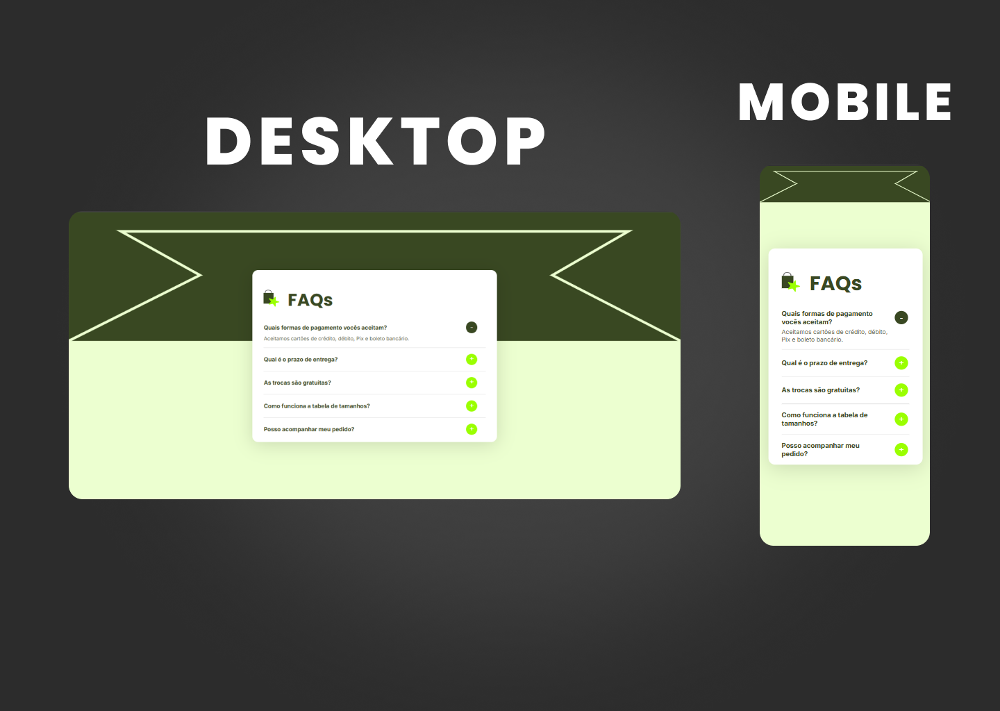

# FAQs

Um projeto simples e moderno de **FAQ (Frequently Asked Questions)**, desenvolvido com **HTML, CSS e JavaScript puro**.  
O objetivo foi criar uma interface limpa, responsiva e funcional que pode ser aplicada em qualquer site de e-commerce ou institucional.

## Demonstração
Veja o projeto online aqui: [Link do projeto hospedado]()   

## Tecnologias
- HTML5
- CSS3 (responsivo e estilização customizada)
- JavaScript (interatividade de abrir/fechar perguntas)

## Funcionalidades
- Alternância de perguntas e respostas (accordion)
- Layout minimalista e responsivo
- Design clean com foco em usabilidade

## O que aprendi e pratiquei
- **Manipulação do DOM** com `querySelectorAll` e `previousElementSibling`
- **Eventos dinâmicos** com `addEventListener`
- **Controle de estado** dos botões (`+` e `-`) usando `classList` e `textContent`
- **UX pensada**: apenas uma pergunta aberta por vez, para não poluir a tela
- **Código escalável**: lógica independente de IDs fixos

---
